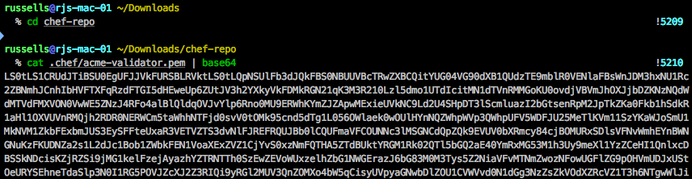
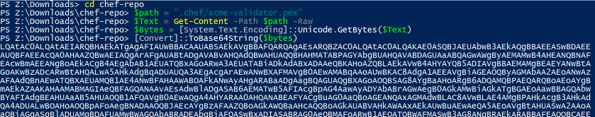

# ARM Template for a Chef node

<a href="https://portal.azure.com/#create/Microsoft.Template/uri/https%3A%2F%2Fraw.githubusercontent.com%2Fchef-partners%2Farm-templates%2Fmaster%2Farm-node-training%2Fazuredeploy.json" target="_blank"></a>
<a href="http://armviz.io/#/?load=https%3A%2F%2Fraw.githubusercontent.com%2Fchef-partners%2Farm-templates%2Fmaster%2Farm-node-training%2Fazuredeploy.json" target="_blank">
    
</a>

*This template is used in Chef training material and should not be used outside of this.  Some values are hardcoded to work with the training environment.  If you do use this template things will not work as expected.*

## Overview

This template will create a new virtual machine that has the Chef Extension installed and registered with the specified Chef server.  The template allows the selection of a `windows` or `linux` machine which means the template can be used multiple times to create different nodes in the environment.

Examples in this document (not the training) use a company name of `acme`.

Please ensure that the first part of the training has been completed which creates a Chef Server in your Azure Subscription.

## Parameters

The following table shows the parameters that this template expects:

| Parameter         | Description                                                                                     | Default Value | Example        |
|:------------------|:------------------------------------------------------------------------------------------------|:--------------|:---------------|
| vmName            | Name of the virtual machine                                                                     |               | acme-node-01   |
| vmPlatform        | The type of machine to create                                                                   |               | linux          |
| adminUsername     | Name of the administrator account                                                               | azure         |                |
| adminPassword     | Password to be set for the admin user                                                           |               |                |
| chefServerUrl     | Full URL to the chef server                                                                     |               | **see below**  |
| chefValidatorName | The name of the validator key                                                                   |               | acme-validator |
| chefValidatorKey  | Base64 encoded string for the validation key                                                    |               |                |
| chefRunlist       | Runlist to be applied to the machine                                                            |               |                |
| sequence          | Helps to create uniquely named resources in the group, required for multiple machine generation | 1             | 2              |

#### vmPlatform

The `vmPlatform` parameter accepts one of two options:

 1. windows
 2. linux

When this template is activate using the link above the Azure Portal UI will present this as a dropdown box.

### Chef Server URL

An eacmple for the chef server url is - https://acme-chefserver.westeurope.cloudapp.azure.com/organizations/acme

### Chef Validator key

The validation key has to be base64 encoded when it is added to the template.  The following code snippets show how to accomplish this for both Windows and Linux machines.  The output of which is should be pasted into the parameter.

#### Linux / Mac OS x

In a terminal window run the following:

```bash
$> cd chef-repo
$> cat .chef/acme-validator.pem | base64
```



#### Windows

In a PowerShell prompt run the following commands:

```powershell
PS > cd chef-repo
PS > $path = ".chef/acme-validator.pem"
PS > $Text = Get-Content -Path $path -Raw
PS > $Bytes = [System.Text.Encoding]::Unicode.GetBytes($Text)
PS > [Convert]::ToBase64String($Bytes)
```



### Sequence Numbers

The names for the network cards and the public IP addresses are set to `nodeNic` and `nodePublicIP` respectively.  The problem is that if more than one machine is created using this template these resources will already exist, so the sequence number is appended to the end of the names.  Thus if it was set to 2, these resources would be called:

  - nodeNic2
  - nodePublicIP2

## Storage account

Everytime the template is used a new storage account is created in the resource group to hold the hard drives for the machine.  This is because the name is randmonly generated for the Chef Server making it harder to derive for this machine.

Note:  There is some work going on to see if this behaviour can be changed.  Please refer to [Issue #6](https://github.com/chef-partners/arm-templates/issues/6) for information on this.
