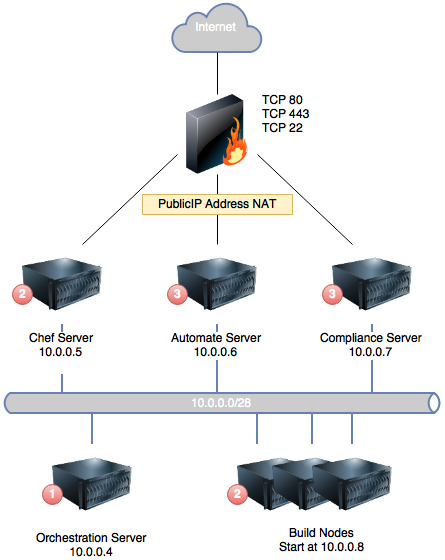

# ARM Template Solutions

This sub directory of the main repo holds templates that build up complete environments of Chef Software components.  

Templates make use of the linked template functionality in Azure to make the various components much more manageable.  This means that when a deployment is called the URI to the template file must be specified as it is from this that Azure can work out the full URLs to the other templates.

## Automate Cluster Template

The `automatecluster.json` template will build a Chef Automate cluster with the following items:

  - Orchestration Server (used to pass around keys and password)
  - Chef Server
  - Automate Server
  - Compliance Server
  - Build Node (1 by default)
  - Workstation (Windows 2012 R2)

The following diagram shows how the servers are configured in Azure



Only the **Chef Server**, **Automate Server** and **Compliance Server** have public ip addresses and are therefore accessible from the Internet.  The rest of the servers are only accessible on the internal network.

The internal IP addresses and subnet are specified as part of the template.  They are defaulted to the values as ssen in the diagram but this can be changed using parameters.

The numbers in red in the above network diagram show in what order the deployment within Azure occurs and therefore the dependencies in the template.

| Step | Description                                                                                                                                                      |
|:-----|:-----------------------------------------------------------------------------------------------------------------------------------------------------------------|
| 1    | Orchestration server is deployed, this is the first machine and all machines wait for it                                                                         |
| 2    | Chef Server and build nodes are started in parallel                                                                                                              |
| 3    | Automate Server and Compliance server start after the Chef Server has completed.  The Automate server has an additional dependency on the build nodes completion |

OMS support is now available in the template.  This means that the standard metrics from the Chef, Automate and Compliance servers are displayed in a nominated OMS Dashboard.  In addition Visibility data from the Automate Server is sent to the dashboard for charting purposes.

Enabling OMS Monitoring is optional, and by default is turned off.

### Parameters

The parameters that are required are detailed in the following table.  A skeleton version of this file is available to edit called `automatecluster.parameters.dist.json`.

| Parameter          | Description                                                                      | Mandatory? | Default Value |
|:-------------------|:---------------------------------------------------------------------------------|:-----------|:--------------|
| prefix             | A prefix that is applied to machines that are created with the template          | yes        |               |
| adminUsername      | Login username for SSH                                                           | yes        | azure         |
| adminPassword      | Password to be associated with the specified username                            | yes        |               |
| chefVersion        | Version of chef to install                                                       | no         |               |
| chefDKVersion      | Version of ChefDK to download for the bootstrap of the build nodes               | no         |               |
| complianceVersion  | Version of the Compliance software to install                                    | no         |               |
| automateVersion    | Version of Chef Automate to install                                              | no         |               |
| userName           | User name to add to all the Chef components                                      | yes        |               |
| userPassword       | Password to associate with the specified userName                                | yes        |               |
| userEmailaddress   | Email address for the new user                                                   | yes        |               |
| userFullname       | Fullname of the new user                                                         | yes        |               |
| chefOrg            | Short name of the organisation to create on the Chef Server                      | yes        |               |
| chefOrgDescription | Long name for the organisation                                                   | yes        |               |
| enableMonitoring | State whether OMS monitoring should be enabled | no | no |
| omsWorkspaceId | ID of the OMS workspace to send data to | no | |
| omsWorkspaceName | The name of the workspace.  This is used to determine the key to access the workspace | no | |
| omsResourceGroup | The resource group in which the OMS Dashboard has been configured | no | resourceGroup().location |
| automateLicense    | Base64 encoded version of the Automate license to use                            | yes        |               |
| networkVNetSize    | Size of the network on the virtual network                                       | no         | 10.0.0.0/24   |
| networkSubnetSize  | Size of the subnet                                                               | no         | 10.0.0.0/28   |
| ipAddresses        | JSON object specifing the static internal IP addresses for the servers           | no         | see note      |
| shortUniqueLength  | The number of charactets from the storage account to append to the computer name | no         | 4             |
| storageAccountType | Type of storage account to create                                                | no         | Standard_LRS  |
| buildNodeCount     | Number of build nodes to created and configure                                   | no         | 1             |
| vmSizes | JSON object containing the size of machines to create for each type of server | no | See `automatecluster.json` |
| spnDetails | JSON object containing the necessary IDs for `Service Principal Name` to use Test-Kitchen | no | See `automatecluster.json` |


**NB**: For the version parameters they are mandatory if the `scratch` template is being used.

**NB**: When the `enableMonitoring` parameter is set to `yes` then all the `oms*` parameters become mandatory.

There is a distinction between the name of the virtual machine as seen in the Azure Portal and the hostname of the computer.  This is because they can be more descriptive in the portal.  The name that is generated is based on the given `prefix` the type of the machine and the first 4 characters of the storage account that is created for the deployment.

So if the `prefix` was set to `foo` and the generated storage account name was `enpf377f3xlj2` the names for the Chef server would be as follows:

| Name                   | Description                                  |
|:-----------------------|:---------------------------------------------|
| foo-chef-enpf          | Computer name                                |
| foo-chef-enpf-VM       | Name of the machine in the Azure Portal      |
| foo-chef-enpf-NIC      | Network card name                            |
| foo-chef-enpf-PublicIp | Name of the Public IP address of the machine |

The computer name is also used as the DNS prefix label for the FQDN.

For the two passwords in the parameters it is recommended that they are randomly generated, e.g.

 - Linux / MacOS X - `openssl rand -base64 12`
 - Windows PowerShell - `-join (33..126 | ForEach-Object {[char]$_} | Get-Random -Count 12)`

#### IP addresses

The default JSON object for the IP addresses is

```json
{
  "orchestration": "10.0.0.4",
  "chefserver": "10.0.0.5",
  "automateserver": "10.0.0.6",
  "complianceserver": "10.0.0.7",
  "buildnodestart": "10.0.0.8"
}
```

A new complete object can be specified in parameters.

### Deployment

In order to use the template a parameters file needs to be populated, use the dist one that has been added to this folder.

**NB**: It is _very_ important that the completed parameters file is not checked into a public or insecure repository as it contains secrets and license keys.  For a quick way to prevent this create the parameter file with the pattern `*.parameters.local.json` and Git will ignore it thanks to the `.gitignore` file.

As the template uses the `uri()` template function the path to the template file must be specified as a URL.

_Azure Xplat CLI_

The following shows an example of the commands to use to create the Resource Group.  The name of the group and the location should be changed to match own requirements.

```bash
azure group create "automate-cluster" "westeurope"
azure group deployment create --template-uri https://raw.githubusercontent.com/chef-partners/arm-templates/master/solutions/automatecluster.json \
-e ./automatecluster.parameters.local.json \
-g "automate-cluster" \
-n "automate-deploy-1"
```

When using the URL for the template file ensure that it points to a public address that Azure can see and if using GitHub it points to the correct branch.

**TIP**:  For testing it is quite useful to use the public folder of your Dropbox account which allows testing without lots of commits.

_PowerShell_

```powershell
New-AzureRmResourceGroup -Name "automate-cluster" -Location "westeurope"
New-AzureRmResourceGroupDeployment -TemplateUri https://raw.githubusercontent.com/chef-partners/arm-templates/master/solutions/automatecluster.json `
-TemplateParameterFile automatecluster.parameters.local.json `
-ResourceGroupName "automate-cluster" `
-Name "automate-deploy-1"
```

### Configure Script

There is a one large Bash script that is used by every machine to bootstrap the various Chef components onto the servers.

This script is called `nested\scripts\setup-ctl.sh`.  The following operations are available in the script:

| Mode                 | Description                                                                                                                                                                                                                                                                      |
|:---------------------|:---------------------------------------------------------------------------------------------------------------------------------------------------------------------------------------------------------------------------------------------------------------------------------|
| orchestration        | Create the SSH key pair for the build nodes                                                                                                                                                                                                                                      |
| chef-install         | Install Chef Server from package                                                                                                                                                                                                                                                 |
| chef-configure       | Configure the Chef server with the specified Organization and the one required for Automate as well as the associated users.  It will also install `chef-manage`, `chef-gate` and `chef-push-jobs`.  All the configuration for integration with Compliance is configured as well |
| chef-oms             | Configure the Chef Server for OMS monitoring                                                                                                                                                                                                                                     |
| automate-install     | Install Automate Server from package                                                                                                                                                                                                                                             |
| automate-configure   | Configure the Automate server with the delivery organisation created on the Chef server (using `etcd` to get the keys) and the specified Licence key                                                                                                                             |
| automate-oms         | Configure the Automate Server for OMS monitoring                                                                                                                                                                                                                                 |
| automate-build-nodes | Bootstrap the build nodes into the Automate Cluster.  Uses the SSH keys that were generated in the `orchestration` mode                                                                                                                                                          |
| compliance-install   | Install Compliance Server from package                                                                                                                                                                                                                                           |
| compliance-configure | Configure the compliance server for oAuth with the Chef Server.  This also configures the policies for access with the `audit` cookbook                                                                                                                                          |
| build-node           | Create the `build` user and put the SSH public key in place so that the Automate server can access it.  Also creates a password less sudo for the user                                                                                                                           |

### Servers

#### Orchestration Server

This server runs the Docker Engine and installs an `etcd` container.  This is what provides a REST based API for storing keys and secrets that other machines in the cluster require.  This is why the Orchestration server is the first machine to be built so it is in place before the other machines are deployed.

Once the Docker container has been deployed the SSH keys are generated for the build nodes and added to the `etcd` store.  This is so that they are in place for when the build servers are deployed and when the Automate server bootstraps the build nodes.

## Automate Cluster with Infrastructure nodes

An additional template has been added to the repo that will not only create the above Automate Cluster but will add the specified number of Infrastructure nodes.

The template is called `automatecluser-infranodes.json` and requires one additional parameter.  The extra parameter is detailed below.  Another distribution parameters file has also been created that contains this new parameter `automatecluster-infranodes.parameters.dist.json`

### Parameters

| Parameter          | Description                                                                      | Mandatory? | Default Value |
|:-------------------|:---------------------------------------------------------------------------------|:-----------|:--------------|
| infrastructureNodes             | A JSON object that cotains the information about the nodes to create          | yes        | See below              |

An example of how to set this parameter can be seen below (and in the `automatecluster-infranodes.parameters.dist.json`) file.

```json
"infrastructureNodes": {
  "value": {
    "count": 1,
    "platform": "windows",
    "sku": "2012-R2-Datacenter",
    "runlist": "recipe[training::default]",
    "environment": "union",
    "configuration": ""
  }
}
```

| Element Name | Description |
|--------------|-------------|
| count | Number of infrastructure nodes to create |
| platform | The type of machine to create, `windows` or `linux` |
| sku | The sku to use to create the machine.  This is from the Azure Marketplace |
| runlist | The runlist to apply to the machine when it is bootstrapped with the Azure Chef Extension |
| environment | The environment on the Chef server that this machine should belong to |
| configuration | Any additional configuration that should be applied to the chef-client on the machine(s) |

**NB** When using complex objects like this, it is important to remember that the entire object must _always_ be specified, it is not possible to override just one value.

At the moment the infrastructure nodes are intended to be Windows machines even though different platforms can be specified.  This is because the configuration script for the nodes is a PowerShell script.

## Chef Nodes

Three new templates have been added to the solutions directory.  These are for creating machines that will be managed Chef nodes:

1. Create x Linux Nodes
2. Create x Windows Nodes
3. Create x Linux and Windows Nodes

**NB** The third template uses the first two templates as linked templates.

These are intended to be used after the Automate Cluster has been built.  There is an example parameters file for the third template, the only difference here is that both the `linuxMachineCount` and `windowsMachineCount` are specified.

The following table shows the parameters that can be passed into the templates.

| Name | Description | Default Value | Comments |
|------|-------------|---------------|----------|
| prefix | Prefix that will be applied to the VM and hostname and DNS name | | |
| adminUsername | Default username for login | azure | |
| adminPassword | Password to be assigned to the admin user | | |
| linuxMachineCount | Number of Linux machines to be created | 5 | Only for `chef-nodes.json` and `chef-nodes-linux.json` |
| windowsMachineCount | Number of Windows machines to be created | 5 | Only for `chef-nodes.json` and `chef-nodes-windows.json` |
| virtualNetworkName | Name of the existing network the machines should connect to | | |
| subnetName | Name of the subnet in the virtual network for the network adapater | | |
| networkRG | Resource Group that the virtual network resides in | | |
| shortUniqueLength | Length of the uniqueness in the machine names | 4 | |
| chefServerUrl | URL to the chef server | | |
| chefValidatorName | Name of the validator key | | | 
| chefRunList | Runlist to be applied to the machines | | |
| chefNodeSSLVerifyMode | SSL verification mode. | peer | If using self signed certificates set this to `none` |
| chefEnvironment | Chef environment the machine should be part of | _default | |
| chefClientConfiguration | Extra configuration that should be added to the `client.rb` file on the machine | | |
| chefValidatorKey | Base64 encoded validation key | | |

Deployment of the nodes is performed in the same way as all the other templates in this folder.  Due to the linking of templates it has to be deployed using a public URL that Azure has access to.  For example:

```bash
azure group deployment create --template-uri https://raw.githubusercontent.com/chef-partners/arm-templates/master/solutions/chef-nodes.json \
-e ./chef-nodes.parameters.json \
-g "automate-cluster" \
-n "automate-deploy-1"
```

```powershell
New-AzureRmResourceGroup -Name "automate-cluster" -Location "westeurope"
New-AzureRmResourceGroupDeployment -TemplateUri https://raw.githubusercontent.com/chef-partners/arm-templates/master/solutions/chef-nodes.json `
-TemplateParameterFile chef-nodes.parameters.json `
-ResourceGroupName "automate-cluster" `
-Name "automate-deploy-1"
```

Due to the fact that the resource group for the network has to be specified it is perfectly reasonable to create the Chef nodes in a different resource group.  This can assist with management of the machines.

## Azure Credentials

As part of the workflow when developing cookbooks it is highly recommended that Test-Kitchen is used to test the cookbooks.  In this environment the Test-Kitchen AzureRM Driver (https://github.com/pendrica/kitchen-azurerm) is installed on the workstation.

In order to use this a credentials file must be created: `~/.azure/credentials`.

This file is created by the `woorkstation` cookbook in the `chefrepo.zip` file.  If the `spnDetails` parameter object has been filled out completely then `~/.azure/credentials` file will be created.

An additional script has been added to this repo `scripts/azurecred.ps1` which is will create the necessary Service Principal Name (SPN) in the users Azure account so that Test-Kitchen is able to create machines in Azure.

The script is a PowerShell script and must be run on Windows.  An example of how to use the script is show below:

```powershell
$> .\azurecreds.ps1 -AzureADServicePrincipalFriendlyName 'Chef Workshop SPN - RJS' -SubscriptionID <AZURE_SUBSCRIPTION_ID> -subscriptionPassword <SUBSCRIPTION_PASSWORD> -subscriptionUsername <SUBSCRIPTION_USERNAME>
``` 

**NB** This script _must_ be run in PowerShell with elevated privileges as it will download and install any missing PowerShell modules.

This will create the credentials file in the `azure` directory of the users home directory that has run the command.  The details can then be copied from here into the template file.

### Parameters

The following table details the parameters that are required by the script

| Parameter name | Description | Example |
|----------------|-------------|---------|
| AzureADServicePrincipalFriendlyName | Name of the SPN when seen in the Azure AD in the subscription | Chef Workshop SPN - RJS |
| SubscriptionID | The ID of the subcription into which this SPN will be created | <UUID> |
| SubscriptionUsername | Username of the account with permissions in the specified subscription id | rseymour@chef.io |
| SubscriptionPassword | Password associated with the specified account | ******* |
